# LoadGo NestJS Realtime Server — Architecture & Flow Documentation

> **Repo**: `loadgo-nestjs-server`
> **Runtime**: NestJS + Socket.IO
> **Purpose**: Real-time trip assignment engine that sits between the LoadGo main backend and the mobile apps (Driver & User).

---

## 1. High-Level Architecture

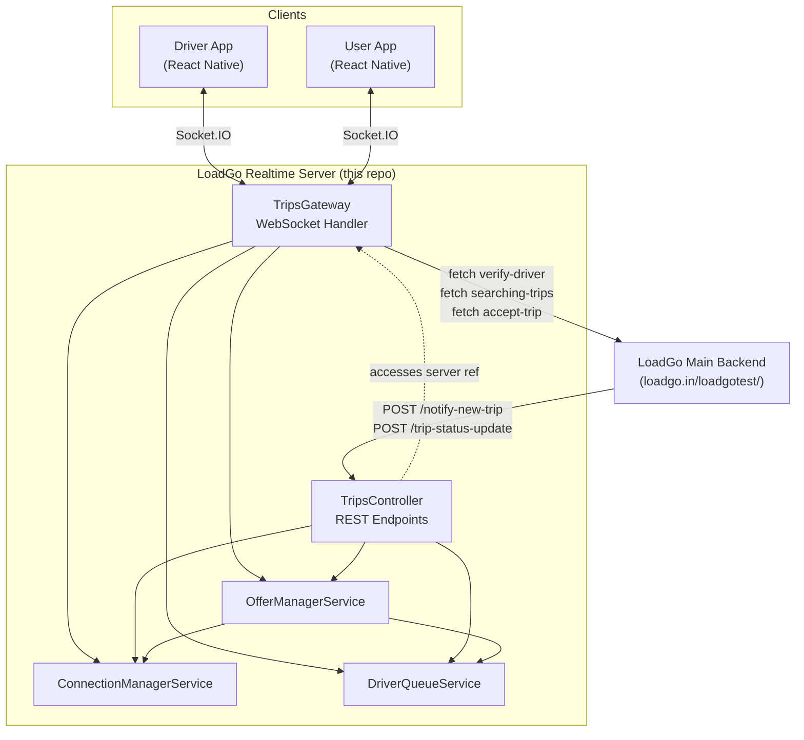
```mermaid
graph TB
    subgraph Clients
        DA["Driver App<br/>(React Native)"]
        UA["User App<br/>(React Native)"]
    end

    subgraph "LoadGo Realtime Server (this repo)"
        GW["TripsGateway<br/>WebSocket Handler"]
        CTRL["TripsController<br/>REST Endpoints"]
        CM["ConnectionManagerService"]
        DQ["DriverQueueService"]
        OM["OfferManagerService"]
    end

    BE["LoadGo Main Backend<br/>(loadgo.in/loadgotest/)"]

    DA <-->|Socket.IO| GW
    UA <-->|Socket.IO| GW
    BE -->|"POST /notify-new-trip<br/>POST /trip-status-update"| CTRL
    GW -->|"fetch verify-driver<br/>fetch searching-trips<br/>fetch accept-trip"| BE
    GW --> CM
    GW --> DQ
    GW --> OM
    CTRL --> CM
    CTRL --> DQ
    CTRL --> OM
    CTRL -.->|"accesses server ref"| GW
    OM --> DQ
    OM --> CM
```

**Key Idea**: The main backend creates trips and talks to this server over REST. Drivers and users connect over WebSocket. This server manages the **real-time offer queue** — deciding which driver sees which trip, when to rotate, and when to expire.

---

## 2. Master Flow Diagrams — Every Request, Step by Step

### 2.1 Complete System Flow — All Entry Points at a Glance


```mermaid
flowchart TB
    subgraph "🌐 REST Entry Points (Main Backend → This Server)"
        R1["POST /notify-new-trip<br/>─────────────────────<br/>📥 Input: { tripId: number, drivers: string[] }<br/>📤 Output: { ok: true }"]
        R2["POST /trip-status-update<br/>─────────────────────<br/>📥 Input: { status: number, tripId: number,<br/>driverId?: string, userId?: string }<br/>📤 Output: { ok: true }"]
        R3["GET /health<br/>─────────────────────<br/>📥 Input: none<br/>📤 Output: { status: ok, uptime: number }"]
    end

    subgraph "🔌 WebSocket Entry Points (Mobile Apps → This Server)"
        W1["REGISTER_DRIVER<br/>─────────────────────<br/>📥 Payload: { driverId, tripId? }"]
        W2["REGISTER_USER<br/>─────────────────────<br/>📥 Payload: { userId, tripId? }"]
        W3["ACCEPT_OFFER<br/>─────────────────────<br/>📥 Payload: { tripId }"]
        W4["REJECT_OFFER<br/>─────────────────────<br/>📥 Payload: { tripId }"]
        W5["disconnect<br/>─────────────────────<br/>📥 Automatic on socket close"]
    end

    subgraph "⚙️ Services (Internal)"
        S1["ConnectionManagerService"]
        S2["DriverQueueService"]
        S3["OfferManagerService"]
    end

    subgraph "📡 Socket Events Fired (This Server → Mobile Apps)"
        E1["OFFER_TRIP → single driver"]
        E2["OFFER_EXPIRED → single driver"]
        E3["TRIP_ACCEPTED → trip room"]
        E4["TRIP_STARTED → trip room"]
        E5["TRIP_COMPLETED → trip room"]
        E6["TRIP_CANCELLED → trip room"]
        E7["CLOSE_RIDE_REQ → all sockets"]
        E8["RIDE_REVOKED → all sockets"]
        E9["RIDE_CANCEL_BY_USER → all sockets"]
        E10["RIDE_CANCEL_BY_DRIVER → all sockets"]
    end

    R1 --> S2
    R1 --> S3
    R2 --> S1
    R2 --> S2
    R2 --> S3

    W1 --> S1
    W1 --> S2
    W1 --> S3
    W2 --> S1
    W3 --> S3
    W4 --> S3
    W5 --> S1
    W5 --> S3

    S3 --> E1
    S3 --> E2
    R2 --> E3
    R2 --> E4
    R2 --> E5
    R2 --> E6
    R2 --> E7
    R2 --> E8
    R2 --> E9
    R2 --> E10
```

---

### 2.2 Flow 1: New Trip Notification (Complete Step-by-Step)

> **Trigger**: Main Backend calls `POST /notify-new-trip`

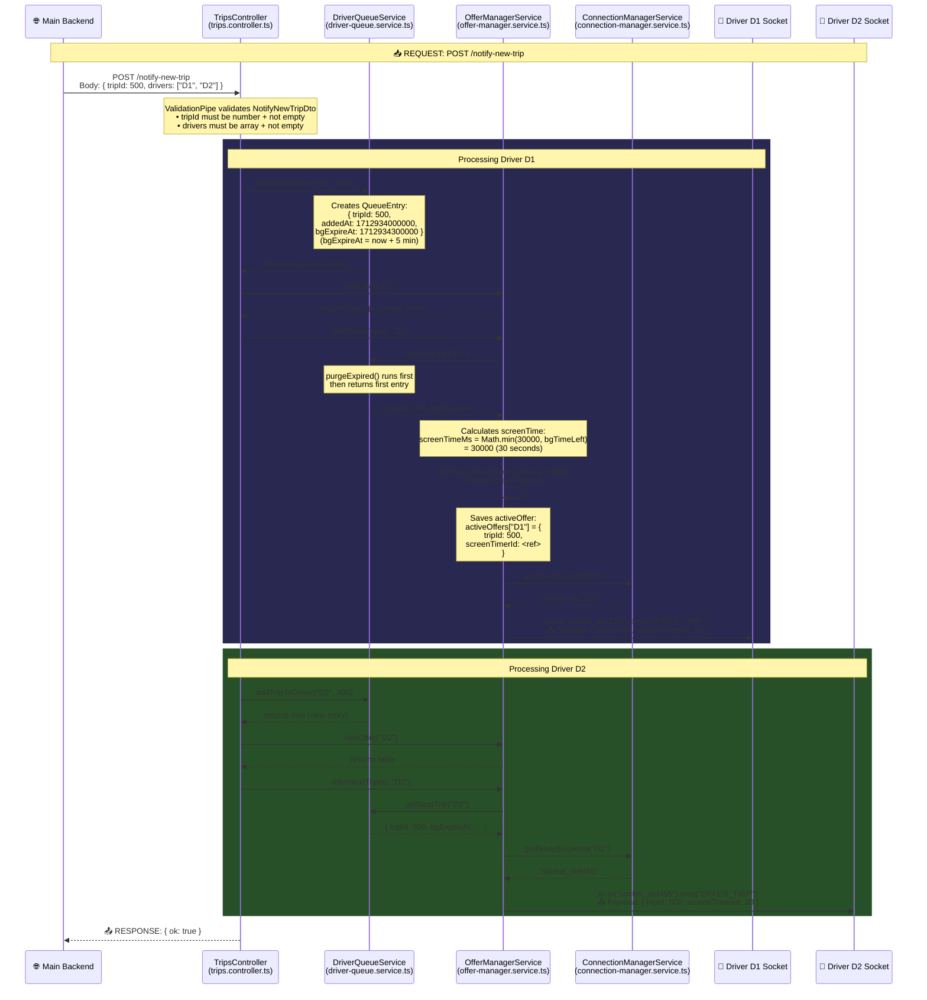
```mermaid
sequenceDiagram
    participant BE as 🌐 Main Backend
    participant CTRL as TripsController<br/>(trips.controller.ts)
    participant DQ as DriverQueueService<br/>(driver-queue.service.ts)
    participant OM as OfferManagerService<br/>(offer-manager.service.ts)
    participant CM as ConnectionManagerService<br/>(connection-manager.service.ts)
    participant D1 as 📱 Driver D1 Socket
    participant D2 as 📱 Driver D2 Socket

    Note over BE,D2: 📥 REQUEST: POST /notify-new-trip

    BE->>CTRL: POST /notify-new-trip<br/>Body: { tripId: 500, drivers: ["D1", "D2"] }
    Note over CTRL: ValidationPipe validates NotifyNewTripDto<br/>• tripId must be number + not empty<br/>• drivers must be array + not empty

    rect rgb(40, 40, 80)
        Note over CTRL,D1: Processing Driver D1
        CTRL->>DQ: addTripToDriver("D1", 500)
        Note over DQ: Creates QueueEntry:<br/>{ tripId: 500,<br/>  addedAt: 1712934000000,<br/>  bgExpireAt: 1712934300000 }<br/>(bgExpireAt = now + 5 min)
        DQ-->>CTRL: returns true (new entry)
        CTRL->>OM: hasOffer("D1")
        OM-->>CTRL: returns false (no active offer)
        CTRL->>OM: offerNextTrip(io, "D1")
        OM->>DQ: getNextTrip("D1")
        Note over DQ: purgeExpired() runs first<br/>then returns first entry
        DQ-->>OM: { tripId: 500, bgExpireAt: ... }
        Note over OM: Calculates screenTime:<br/>screenTimeMs = Math.min(30000, bgTimeLeft)<br/>= 30000 (30 seconds)
        OM->>OM: setTimeout(onScreenTimeout, 30000)<br/>stores screenTimerId
        Note over OM: Saves activeOffer:<br/>activeOffers["D1"] = {<br/>  tripId: 500,<br/>  screenTimerId: <ref><br/>}
        OM->>CM: getDriverSocketId("D1")
        CM-->>OM: "socket_abc123"
        OM->>D1: io.to("socket_abc123").emit("OFFER_TRIP")<br/>📤 Payload: { tripId: 500, screenTimeout: 30 }
    end

    rect rgb(40, 80, 40)
        Note over CTRL,D2: Processing Driver D2
        CTRL->>DQ: addTripToDriver("D2", 500)
        DQ-->>CTRL: returns true (new entry)
        CTRL->>OM: hasOffer("D2")
        OM-->>CTRL: returns false
        CTRL->>OM: offerNextTrip(io, "D2")
        OM->>DQ: getNextTrip("D2")
        DQ-->>OM: { tripId: 500, bgExpireAt: ... }
        OM->>CM: getDriverSocketId("D2")
        CM-->>OM: "socket_def456"
        OM->>D2: io.to("socket_def456").emit("OFFER_TRIP")<br/>📤 Payload: { tripId: 500, screenTimeout: 30 }
    end

    CTRL-->>BE: 📤 RESPONSE: { ok: true }
```

---

### 2.3 Flow 2: Driver Accepts a Trip (Complete Step-by-Step)

> **Trigger**: Driver App emits `ACCEPT_OFFER` via socket

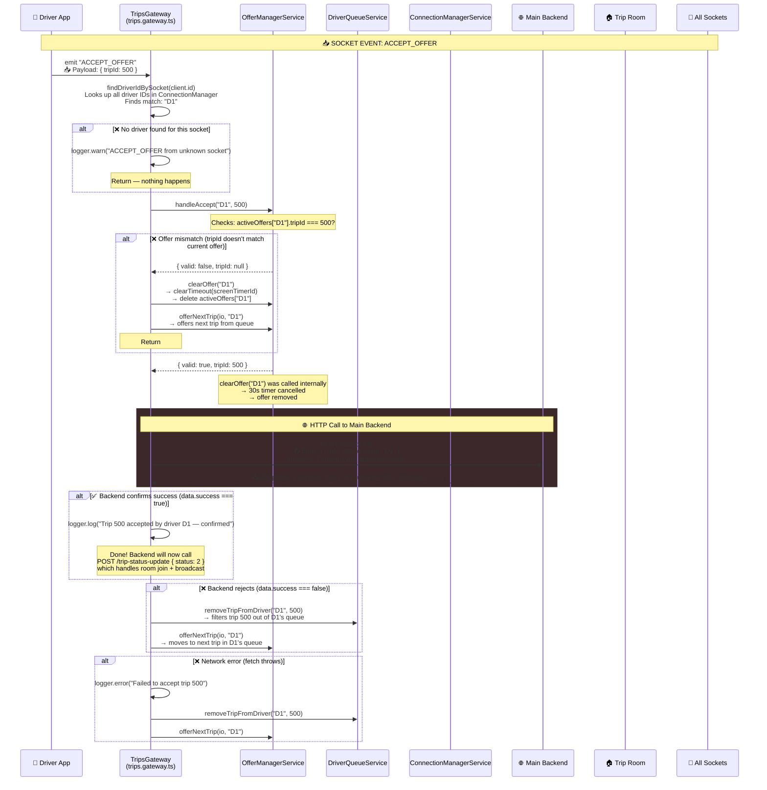
```mermaid
sequenceDiagram
    participant D1 as 📱 Driver App
    participant GW as TripsGateway<br/>(trips.gateway.ts)
    participant OM as OfferManagerService
    participant DQ as DriverQueueService
    participant CM as ConnectionManagerService
    participant BE as 🌐 Main Backend
    participant Room as 🏠 Trip Room
    participant All as 📢 All Sockets

    Note over D1,All: 📥 SOCKET EVENT: ACCEPT_OFFER

    D1->>GW: emit "ACCEPT_OFFER"<br/>📥 Payload: { tripId: 500 }

    GW->>GW: findDriverIdBySocket(client.id)<br/>Looks up all driver IDs in ConnectionManager<br/>Finds match: "D1"

    alt ❌ No driver found for this socket
        GW->>GW: logger.warn("ACCEPT_OFFER from unknown socket")
        Note over GW: Return — nothing happens
    end

    GW->>OM: handleAccept("D1", 500)
    Note over OM: Checks: activeOffers["D1"].tripId === 500?

    alt ❌ Offer mismatch (tripId doesn't match current offer)
        OM-->>GW: { valid: false, tripId: null }
        GW->>OM: clearOffer("D1")<br/>→ clearTimeout(screenTimerId)<br/>→ delete activeOffers["D1"]
        GW->>OM: offerNextTrip(io, "D1")<br/>→ offers next trip from queue
        Note over GW: Return
    end

    OM-->>GW: { valid: true, tripId: 500 }
    Note over OM: clearOffer("D1") was called internally<br/>→ 30s timer cancelled<br/>→ offer removed

    rect rgb(60, 40, 40)
        Note over GW,BE: 🌐 HTTP Call to Main Backend
        GW->>BE: POST /accept-trip<br/>📤 Body: { tripId: 500, driverId: "D1" }<br/>Headers: Content-Type: application/json
        BE-->>GW: 📥 Response: { success: true } or { success: false, message: "..." }
    end

    alt ✅ Backend confirms success (data.success === true)
        GW->>GW: logger.log("Trip 500 accepted by driver D1 — confirmed")
        Note over GW: Done! Backend will now call<br/>POST /trip-status-update { status: 2 }<br/>which handles room join + broadcast
    end

    alt ❌ Backend rejects (data.success === false)
        GW->>DQ: removeTripFromDriver("D1", 500)<br/>→ filters trip 500 out of D1's queue
        GW->>OM: offerNextTrip(io, "D1")<br/>→ moves to next trip in D1's queue
    end

    alt ❌ Network error (fetch throws)
        GW->>GW: logger.error("Failed to accept trip 500")
        GW->>DQ: removeTripFromDriver("D1", 500)
        GW->>OM: offerNextTrip(io, "D1")
    end
```

---

### 2.4 Flow 3: Trip Status Update — ACCEPTED (Status 2)

> **Trigger**: Main Backend calls `POST /trip-status-update` with status `2`

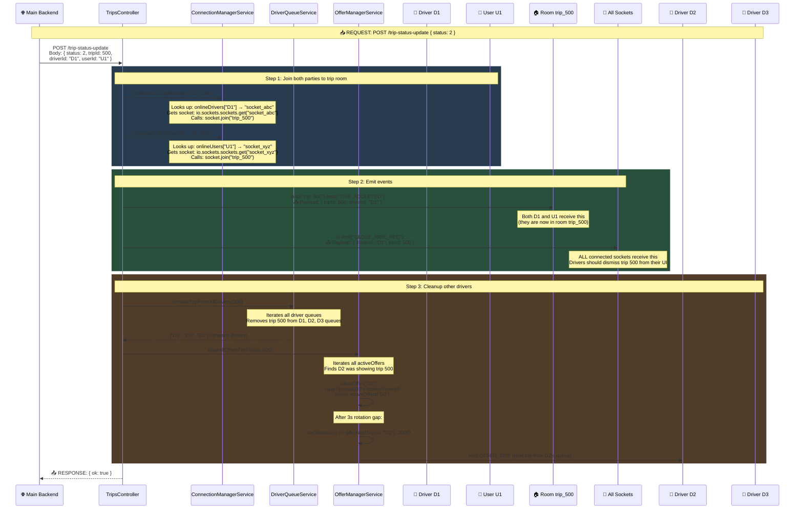
```mermaid
sequenceDiagram
    participant BE as 🌐 Main Backend
    participant CTRL as TripsController
    participant CM as ConnectionManagerService
    participant DQ as DriverQueueService
    participant OM as OfferManagerService
    participant D1 as 📱 Driver D1
    participant U1 as 📱 User U1
    participant Room as 🏠 Room trip_500
    participant All as 📢 All Sockets
    participant D2 as 📱 Driver D2
    participant D3 as 📱 Driver D3

    Note over BE,D3: 📥 REQUEST: POST /trip-status-update { status: 2 }

    BE->>CTRL: POST /trip-status-update<br/>Body: { status: 2, tripId: 500,<br/>driverId: "D1", userId: "U1" }

    rect rgb(40, 60, 80)
        Note over CTRL,U1: Step 1: Join both parties to trip room
        CTRL->>CM: joinDriverToTripRoom(io, "D1", 500)
        Note over CM: Looks up: onlineDrivers["D1"] → "socket_abc"<br/>Gets socket: io.sockets.sockets.get("socket_abc")<br/>Calls: socket.join("trip_500")
        CTRL->>CM: joinUserToTripRoom(io, "U1", 500)
        Note over CM: Looks up: onlineUsers["U1"] → "socket_xyz"<br/>Gets socket: io.sockets.sockets.get("socket_xyz")<br/>Calls: socket.join("trip_500")
    end

    rect rgb(40, 80, 60)
        Note over CTRL,All: Step 2: Emit events
        CTRL->>Room: io.to("trip_500").emit("TRIP_ACCEPTED")<br/>📤 Payload: { tripId: 500, driverId: "D1" }
        Note over Room: Both D1 and U1 receive this<br/>(they are now in room trip_500)
        CTRL->>All: io.emit("CLOSE_RIDE_REQ")<br/>📤 Payload: { driverId: "D1", tripId: 500 }
        Note over All: ALL connected sockets receive this<br/>Drivers should dismiss trip 500 from their UI
    end

    rect rgb(80, 60, 40)
        Note over CTRL,D3: Step 3: Cleanup other drivers
        CTRL->>DQ: removeTripFromAllDrivers(500)
        Note over DQ: Iterates all driver queues<br/>Removes trip 500 from D1, D2, D3 queues
        DQ-->>CTRL: ["D1", "D2", "D3"] (affected drivers)

        CTRL->>OM: clearAllOffersForTrip(io, 500)
        Note over OM: Iterates all activeOffers<br/>Finds D2 was showing trip 500
        OM->>OM: clearOffer("D2")<br/>→ clearTimeout(D2's screenTimerId)<br/>→ delete activeOffers["D2"]
        Note over OM: After 3s rotation gap:
        OM->>OM: setTimeout(() => offerNextTrip(io, "D2"), 3000)
        OM->>D2: emit OFFER_TRIP (next trip from D2's queue)
    end

    CTRL-->>BE: 📤 RESPONSE: { ok: true }
```

---

### 2.5 Flow 4: All Other Status Updates

> **Trigger**: Main Backend calls `POST /trip-status-update` with status 3-8

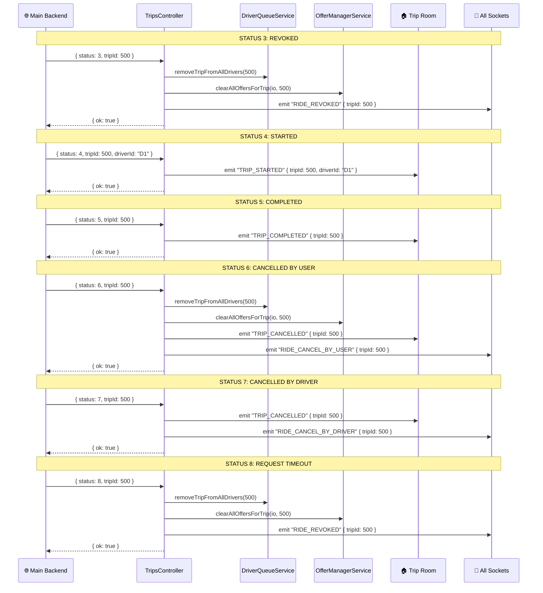
```mermaid
sequenceDiagram
    participant BE as 🌐 Main Backend
    participant CTRL as TripsController
    participant DQ as DriverQueueService
    participant OM as OfferManagerService
    participant Room as 🏠 Trip Room
    participant All as 📢 All Sockets

    Note over BE,All: STATUS 3: REVOKED
    BE->>CTRL: { status: 3, tripId: 500 }
    CTRL->>DQ: removeTripFromAllDrivers(500)
    CTRL->>OM: clearAllOffersForTrip(io, 500)
    CTRL->>All: emit "RIDE_REVOKED" { tripId: 500 }
    CTRL-->>BE: { ok: true }

    Note over BE,All: STATUS 4: STARTED
    BE->>CTRL: { status: 4, tripId: 500, driverId: "D1" }
    CTRL->>Room: emit "TRIP_STARTED" { tripId: 500, driverId: "D1" }
    CTRL-->>BE: { ok: true }

    Note over BE,All: STATUS 5: COMPLETED
    BE->>CTRL: { status: 5, tripId: 500 }
    CTRL->>Room: emit "TRIP_COMPLETED" { tripId: 500 }
    CTRL-->>BE: { ok: true }

    Note over BE,All: STATUS 6: CANCELLED BY USER
    BE->>CTRL: { status: 6, tripId: 500 }
    CTRL->>DQ: removeTripFromAllDrivers(500)
    CTRL->>OM: clearAllOffersForTrip(io, 500)
    CTRL->>Room: emit "TRIP_CANCELLED" { tripId: 500 }
    CTRL->>All: emit "RIDE_CANCEL_BY_USER" { tripId: 500 }
    CTRL-->>BE: { ok: true }

    Note over BE,All: STATUS 7: CANCELLED BY DRIVER
    BE->>CTRL: { status: 7, tripId: 500 }
    CTRL->>Room: emit "TRIP_CANCELLED" { tripId: 500 }
    CTRL->>All: emit "RIDE_CANCEL_BY_DRIVER" { tripId: 500 }
    CTRL-->>BE: { ok: true }

    Note over BE,All: STATUS 8: REQUEST TIMEOUT
    BE->>CTRL: { status: 8, tripId: 500 }
    CTRL->>DQ: removeTripFromAllDrivers(500)
    CTRL->>OM: clearAllOffersForTrip(io, 500)
    CTRL->>All: emit "RIDE_REVOKED" { tripId: 500 }
    CTRL-->>BE: { ok: true }
```

---

### 2.6 Flow 5: Driver Registration (Complete Step-by-Step)

> **Trigger**: Driver App connects via Socket.IO and emits `REGISTER_DRIVER`

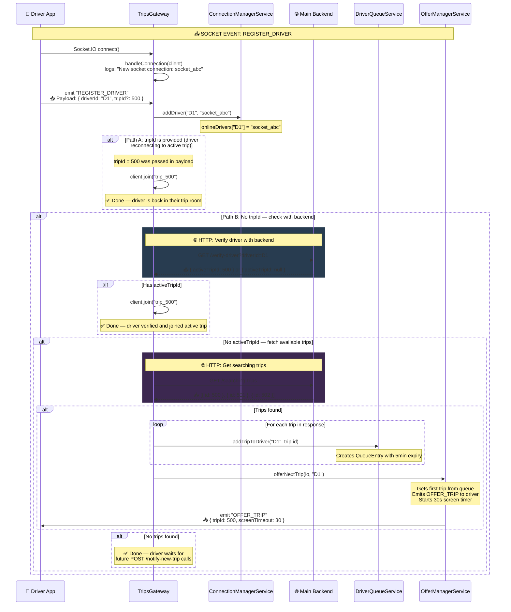
```mermaid
sequenceDiagram
    participant D as 📱 Driver App
    participant GW as TripsGateway
    participant CM as ConnectionManagerService
    participant BE as 🌐 Main Backend
    participant DQ as DriverQueueService
    participant OM as OfferManagerService

    Note over D,OM: 📥 SOCKET EVENT: REGISTER_DRIVER

    D->>GW: Socket.IO connect()
    GW->>GW: handleConnection(client)<br/>logs: "New socket connection: socket_abc"

    D->>GW: emit "REGISTER_DRIVER"<br/>📥 Payload: { driverId: "D1", tripId?: 500 }

    GW->>CM: addDriver("D1", "socket_abc")
    Note over CM: onlineDrivers["D1"] = "socket_abc"

    alt Path A: tripId is provided (driver reconnecting to active trip)
        Note over GW: tripId = 500 was passed in payload
        GW->>GW: client.join("trip_500")
        Note over GW: ✅ Done — driver is back in their trip room
    end

    alt Path B: No tripId — check with backend
        rect rgb(40, 60, 80)
            Note over GW,BE: 🌐 HTTP: Verify driver with backend
            GW->>BE: GET /verify-driver?driverId=D1
            BE-->>GW: 📥 { activeTripId: 500 } or { activeTripId: null }
        end

        alt Has activeTripId
            GW->>GW: client.join("trip_500")
            Note over GW: ✅ Done — driver verified and joined active trip
        end

        alt No activeTripId — fetch available trips
            rect rgb(60, 40, 80)
                Note over GW,BE: 🌐 HTTP: Get searching trips
                GW->>BE: GET /searching-trips
                BE-->>GW: 📥 [{ id: 500 }, { id: 501 }, { id: 502 }]
            end

            alt Trips found
                loop For each trip in response
                    GW->>DQ: addTripToDriver("D1", trip.id)
                    Note over DQ: Creates QueueEntry with 5min expiry
                end
                GW->>OM: offerNextTrip(io, "D1")
                Note over OM: Gets first trip from queue<br/>Emits OFFER_TRIP to driver<br/>Starts 30s screen timer
                OM->>D: emit "OFFER_TRIP"<br/>📤 { tripId: 500, screenTimeout: 30 }
            end

            alt No trips found
                Note over GW: ✅ Done — driver waits for<br/>future POST /notify-new-trip calls
            end
        end
    end
```

---

### 2.7 Flow 6: User Registration (Complete Step-by-Step)

> **Trigger**: User App connects via Socket.IO and emits `REGISTER_USER`

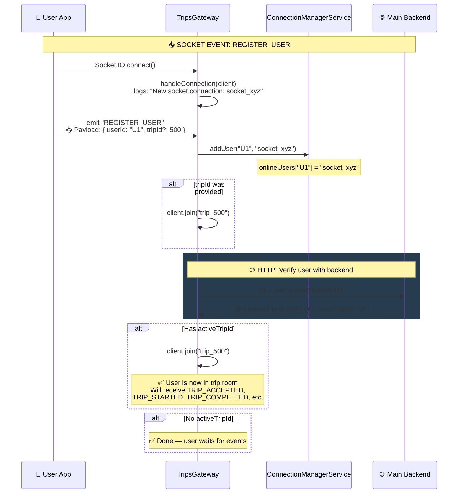
```mermaid
sequenceDiagram
    participant U as 📱 User App
    participant GW as TripsGateway
    participant CM as ConnectionManagerService
    participant BE as 🌐 Main Backend

    Note over U,BE: 📥 SOCKET EVENT: REGISTER_USER

    U->>GW: Socket.IO connect()
    GW->>GW: handleConnection(client)<br/>logs: "New socket connection: socket_xyz"

    U->>GW: emit "REGISTER_USER"<br/>📥 Payload: { userId: "U1", tripId?: 500 }

    GW->>CM: addUser("U1", "socket_xyz")
    Note over CM: onlineUsers["U1"] = "socket_xyz"

    alt tripId was provided
        GW->>GW: client.join("trip_500")
    end

    rect rgb(40, 60, 80)
        Note over GW,BE: 🌐 HTTP: Verify user with backend
        GW->>BE: GET /verify-user?userId=U1
        BE-->>GW: 📥 { activeTripId: 500 } or { activeTripId: null }
    end

    alt Has activeTripId
        GW->>GW: client.join("trip_500")
        Note over GW: ✅ User is now in trip room<br/>Will receive TRIP_ACCEPTED,<br/>TRIP_STARTED, TRIP_COMPLETED, etc.
    end

    alt No activeTripId
        Note over GW: ✅ Done — user waits for events
    end
```

---

### 2.8 Flow 7: Driver Rejects Offer / Screen Timer Expires

> **Trigger**: Driver emits `REJECT_OFFER` OR 30-second screen timer fires

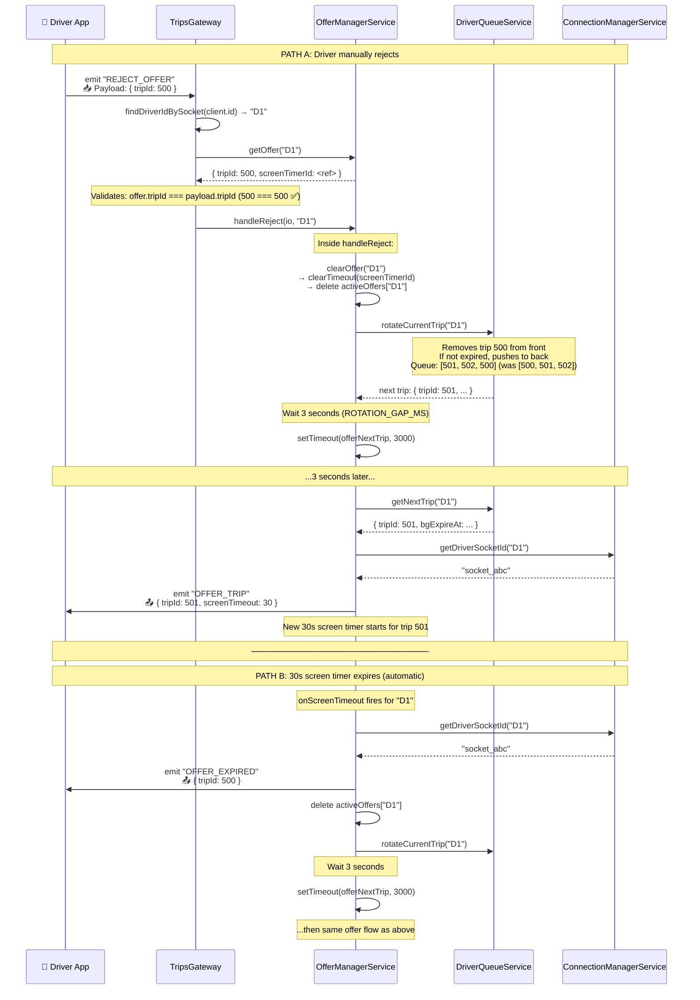
```mermaid
sequenceDiagram
    participant D as 📱 Driver App
    participant GW as TripsGateway
    participant OM as OfferManagerService
    participant DQ as DriverQueueService
    participant CM as ConnectionManagerService

    Note over D,CM: PATH A: Driver manually rejects

    D->>GW: emit "REJECT_OFFER"<br/>📥 Payload: { tripId: 500 }
    GW->>GW: findDriverIdBySocket(client.id) → "D1"
    GW->>OM: getOffer("D1")
    OM-->>GW: { tripId: 500, screenTimerId: <ref> }
    Note over GW: Validates: offer.tripId === payload.tripId (500 === 500 ✅)
    GW->>OM: handleReject(io, "D1")

    Note over OM: Inside handleReject:
    OM->>OM: clearOffer("D1")<br/>→ clearTimeout(screenTimerId)<br/>→ delete activeOffers["D1"]
    OM->>DQ: rotateCurrentTrip("D1")
    Note over DQ: Removes trip 500 from front<br/>If not expired, pushes to back<br/>Queue: [501, 502, 500] (was [500, 501, 502])
    DQ-->>OM: next trip: { tripId: 501, ... }
    Note over OM: Wait 3 seconds (ROTATION_GAP_MS)
    OM->>OM: setTimeout(offerNextTrip, 3000)

    Note over D,CM: ...3 seconds later...

    OM->>DQ: getNextTrip("D1")
    DQ-->>OM: { tripId: 501, bgExpireAt: ... }
    OM->>CM: getDriverSocketId("D1")
    CM-->>OM: "socket_abc"
    OM->>D: emit "OFFER_TRIP"<br/>📤 { tripId: 501, screenTimeout: 30 }
    Note over OM: New 30s screen timer starts for trip 501

    Note over D,CM: ──────────────────────────────
    Note over D,CM: PATH B: 30s screen timer expires (automatic)

    Note over OM: onScreenTimeout fires for "D1"
    OM->>CM: getDriverSocketId("D1")
    CM-->>OM: "socket_abc"
    OM->>D: emit "OFFER_EXPIRED"<br/>📤 { tripId: 500 }
    OM->>OM: delete activeOffers["D1"]
    OM->>DQ: rotateCurrentTrip("D1")
    Note over OM: Wait 3 seconds
    OM->>OM: setTimeout(offerNextTrip, 3000)
    Note over OM: ...then same offer flow as above
```

---

### 2.9 Flow 8: Socket Disconnect (Driver or User)

> **Trigger**: Socket connection drops (app closed, network lost, etc.)

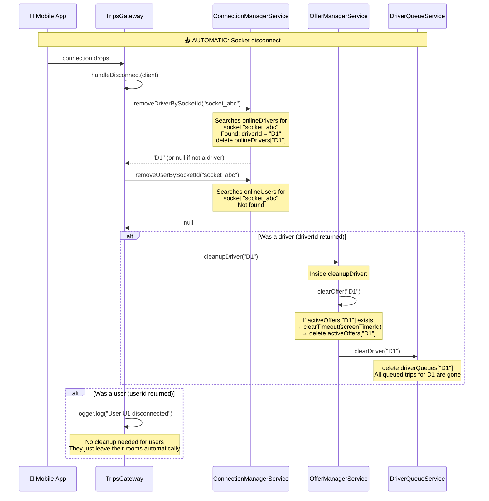
```mermaid
sequenceDiagram
    participant Client as 📱 Mobile App
    participant GW as TripsGateway
    participant CM as ConnectionManagerService
    participant OM as OfferManagerService
    participant DQ as DriverQueueService

    Note over Client,DQ: 📥 AUTOMATIC: Socket disconnect

    Client->>GW: connection drops
    GW->>GW: handleDisconnect(client)

    GW->>CM: removeDriverBySocketId("socket_abc")
    Note over CM: Searches onlineDrivers for<br/>socket "socket_abc"<br/>Found: driverId = "D1"<br/>delete onlineDrivers["D1"]
    CM-->>GW: "D1" (or null if not a driver)

    GW->>CM: removeUserBySocketId("socket_abc")
    Note over CM: Searches onlineUsers for<br/>socket "socket_abc"<br/>Not found
    CM-->>GW: null

    alt Was a driver (driverId returned)
        GW->>OM: cleanupDriver("D1")
        Note over OM: Inside cleanupDriver:

        OM->>OM: clearOffer("D1")
        Note over OM: If activeOffers["D1"] exists:<br/>→ clearTimeout(screenTimerId)<br/>→ delete activeOffers["D1"]

        OM->>DQ: clearDriver("D1")
        Note over DQ: delete driverQueues["D1"]<br/>All queued trips for D1 are gone
    end

    alt Was a user (userId returned)
        GW->>GW: logger.log("User U1 disconnected")
        Note over GW: No cleanup needed for users<br/>They just leave their rooms automatically
    end
```

---

### 2.10 Complete Trip Lifecycle — Master Sequence Diagram

> This is the **full end-to-end flow** of a trip from user request to completion, showing every system it touches.

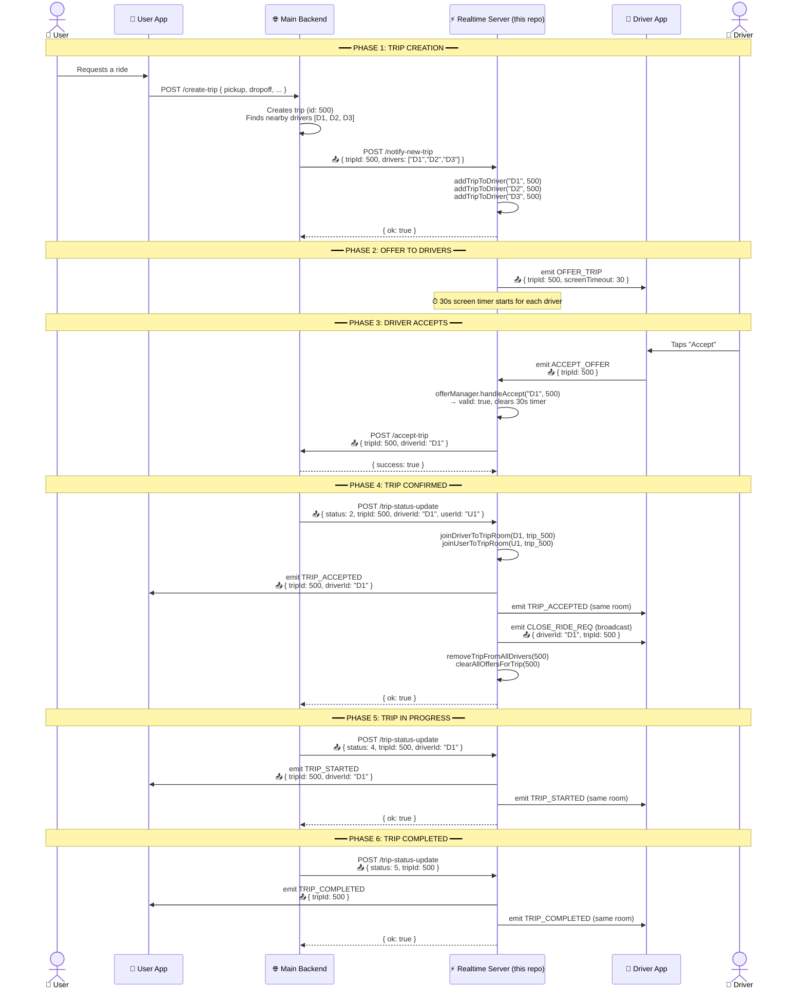
```mermaid
sequenceDiagram
    actor User as 👤 User
    participant UA as 📱 User App
    participant BE as 🌐 Main Backend
    participant RS as ⚡ Realtime Server (this repo)
    participant DA as 📱 Driver App
    actor Driver as 🚗 Driver

    Note over User,Driver: ━━━ PHASE 1: TRIP CREATION ━━━

    User->>UA: Requests a ride
    UA->>BE: POST /create-trip { pickup, dropoff, ... }
    BE->>BE: Creates trip (id: 500)<br/>Finds nearby drivers [D1, D2, D3]
    BE->>RS: POST /notify-new-trip<br/>📤 { tripId: 500, drivers: ["D1","D2","D3"] }
    RS->>RS: addTripToDriver("D1", 500)<br/>addTripToDriver("D2", 500)<br/>addTripToDriver("D3", 500)
    RS-->>BE: { ok: true }

    Note over User,Driver: ━━━ PHASE 2: OFFER TO DRIVERS ━━━

    RS->>DA: emit OFFER_TRIP<br/>📤 { tripId: 500, screenTimeout: 30 }
    Note over RS: ⏱ 30s screen timer starts for each driver

    Note over User,Driver: ━━━ PHASE 3: DRIVER ACCEPTS ━━━

    Driver->>DA: Taps "Accept"
    DA->>RS: emit ACCEPT_OFFER<br/>📤 { tripId: 500 }
    RS->>RS: offerManager.handleAccept("D1", 500)<br/>→ valid: true, clears 30s timer
    RS->>BE: POST /accept-trip<br/>📤 { tripId: 500, driverId: "D1" }
    BE-->>RS: { success: true }

    Note over User,Driver: ━━━ PHASE 4: TRIP CONFIRMED ━━━

    BE->>RS: POST /trip-status-update<br/>📤 { status: 2, tripId: 500, driverId: "D1", userId: "U1" }
    RS->>RS: joinDriverToTripRoom(D1, trip_500)<br/>joinUserToTripRoom(U1, trip_500)
    RS->>UA: emit TRIP_ACCEPTED<br/>📤 { tripId: 500, driverId: "D1" }
    RS->>DA: emit TRIP_ACCEPTED (same room)
    RS->>DA: emit CLOSE_RIDE_REQ (broadcast)<br/>📤 { driverId: "D1", tripId: 500 }
    RS->>RS: removeTripFromAllDrivers(500)<br/>clearAllOffersForTrip(500)
    RS-->>BE: { ok: true }

    Note over User,Driver: ━━━ PHASE 5: TRIP IN PROGRESS ━━━

    BE->>RS: POST /trip-status-update<br/>📤 { status: 4, tripId: 500, driverId: "D1" }
    RS->>UA: emit TRIP_STARTED<br/>📤 { tripId: 500, driverId: "D1" }
    RS->>DA: emit TRIP_STARTED (same room)
    RS-->>BE: { ok: true }

    Note over User,Driver: ━━━ PHASE 6: TRIP COMPLETED ━━━

    BE->>RS: POST /trip-status-update<br/>📤 { status: 5, tripId: 500 }
    RS->>UA: emit TRIP_COMPLETED<br/>📤 { tripId: 500 }
    RS->>DA: emit TRIP_COMPLETED (same room)
    RS-->>BE: { ok: true }
```

---

## 3. Project Structure

```
src/
├── main.ts                          # Bootstrap — creates app, enables CORS, validation pipe, listens on port 3000
├── app.module.ts                    # Root module — imports TripsModule
├── app.controller.ts                # GET /health → { status: "ok", uptime }
│
├── config/
│   ├── app.config.ts                # BACKEND_BASE_URL, SCREEN_TIMER_MS (30s), BACKGROUND_TIMER_MS (5min), ROTATION_GAP_MS (3s)
│   └── events.constant.ts          # All socket event name constants
│
└── trips/
    ├── trips.module.ts              # Wires controller + gateway + 3 services
    ├── controllers/
    │   └── trips.controller.ts      # REST: notify-new-trip, trip-status-update
    ├── gateways/
    │   └── trips.gateway.ts         # WebSocket: REGISTER_DRIVER, REGISTER_USER, ACCEPT_OFFER, REJECT_OFFER
    ├── dto/
    │   └── trip.dto.ts              # NotifyNewTripDto, TripStatusUpdateDto (class-validator)
    └── services/
        ├── connection-manager.service.ts  # Maps driverId/userId ↔ socketId, room management
        ├── driver-queue.service.ts        # Per-driver FIFO trip queue with background expiry
        └── offer-manager.service.ts       # Active offers, screen timer, rotation logic
```

---

## 4. Module Dependency Graph

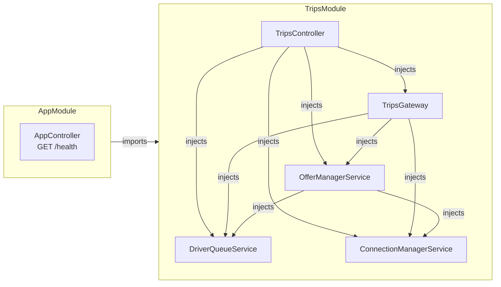
```mermaid
graph LR
    subgraph AppModule
        AC["AppController<br/>GET /health"]
    end

    subgraph TripsModule
        TC["TripsController"]
        TG["TripsGateway"]
        CMS["ConnectionManagerService"]
        DQS["DriverQueueService"]
        OMS["OfferManagerService"]
    end

    AppModule -->|imports| TripsModule

    TC -->|injects| DQS
    TC -->|injects| OMS
    TC -->|injects| CMS
    TC -->|injects| TG

    TG -->|injects| CMS
    TG -->|injects| DQS
    TG -->|injects| OMS

    OMS -->|injects| DQS
    OMS -->|injects| CMS
```

---

## 5. All Entry Points — Complete Reference

### 5.1 REST Endpoints (called by the main backend)

#### `GET /health`

| Property | Value |
|---|---|
| **File** | [`src/app.controller.ts`](src/app.controller.ts) |
| **Input** | None |
| **Output** | `{ status: "ok", uptime: <seconds> }` |
| **Purpose** | Liveness check |

---

#### `POST /notify-new-trip`

| Property | Value |
|---|---|
| **File** | [`src/trips/controllers/trips.controller.ts`](src/trips/controllers/trips.controller.ts) |
| **DTO** | `NotifyNewTripDto` |
| **Input** | `{ tripId: number, drivers: (string\|number)[] }` |
| **Output** | `{ ok: true }` |

**What happens step by step:**

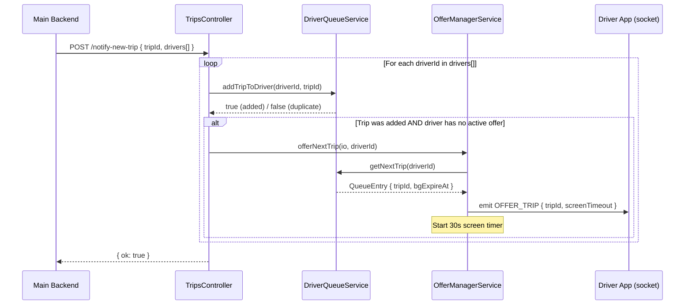
```mermaid
sequenceDiagram
    participant BE as Main Backend
    participant CTRL as TripsController
    participant DQ as DriverQueueService
    participant OM as OfferManagerService
    participant Driver as Driver App (socket)

    BE->>CTRL: POST /notify-new-trip { tripId, drivers[] }

    loop For each driverId in drivers[]
        CTRL->>DQ: addTripToDriver(driverId, tripId)
        DQ-->>CTRL: true (added) / false (duplicate)

        alt Trip was added AND driver has no active offer
            CTRL->>OM: offerNextTrip(io, driverId)
            OM->>DQ: getNextTrip(driverId)
            DQ-->>OM: QueueEntry { tripId, bgExpireAt }
            OM->>Driver: emit OFFER_TRIP { tripId, screenTimeout }
            Note over OM: Start 30s screen timer
        end
    end

    CTRL-->>BE: { ok: true }
```

**Detailed flow:**
1. Backend sends `tripId` + list of eligible `drivers`
2. For **each driver**, `DriverQueueService.addTripToDriver()` is called:
   - Creates a `QueueEntry { tripId, addedAt: Date.now(), bgExpireAt: now + 5min }`
   - Returns `false` if trip already in that driver's queue (skips)
3. If the trip was successfully added **and** the driver doesn't already have an offer on screen → `OfferManagerService.offerNextTrip()` is called to push the first available trip to the driver

---

#### `POST /trip-status-update`

| Property | Value |
|---|---|
| **File** | [`src/trips/controllers/trips.controller.ts`](src/trips/controllers/trips.controller.ts) |
| **DTO** | `TripStatusUpdateDto` |
| **Input** | `{ status: number, tripId: number, driverId?: string\|number, userId?: string\|number }` |
| **Output** | `{ ok: true }` or `{ ok: false, message: "Invalid status code" }` |

**Status codes and their effects:**

| Status Code | Name | What Happens |
|---|---|---|
| **1** | `REQUESTED` | *(not handled — trips arrive via notify-new-trip)* |
| **2** | `ACCEPTED` | Joins driver + user to trip room → emits `TRIP_ACCEPTED` to room → emits `CLOSE_RIDE_REQ` globally → removes trip from all queues → clears all offers for this trip |
| **3** | `REVOKED` | Removes trip from all queues → clears all offers → emits `RIDE_REVOKED` globally |
| **4** | `STARTED` | Emits `TRIP_STARTED` to trip room |
| **5** | `COMPLETED` | Emits `TRIP_COMPLETED` to trip room |
| **6** | `CANCELLED_BY_USER` | Removes trip from all queues → clears offers → emits `TRIP_CANCELLED` to room + `RIDE_CANCEL_BY_USER` globally |
| **7** | `CANCELLED_BY_DRIVER` | Emits `TRIP_CANCELLED` to room + `RIDE_CANCEL_BY_DRIVER` globally |
| **8** | `REQUEST_TIMEOUT` | Removes trip from all queues → clears offers → emits `RIDE_REVOKED` globally |

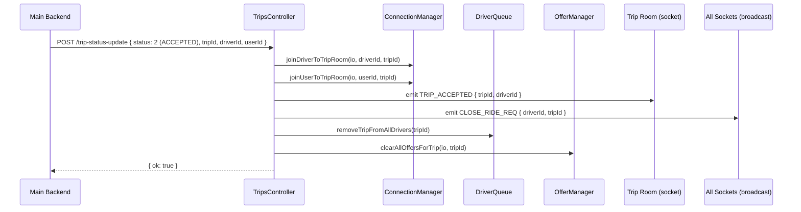
```mermaid
sequenceDiagram
    participant BE as Main Backend
    participant CTRL as TripsController
    participant CM as ConnectionManager
    participant DQ as DriverQueue
    participant OM as OfferManager
    participant Room as Trip Room (socket)
    participant All as All Sockets (broadcast)

    BE->>CTRL: POST /trip-status-update { status: 2 (ACCEPTED), tripId, driverId, userId }

    CTRL->>CM: joinDriverToTripRoom(io, driverId, tripId)
    CTRL->>CM: joinUserToTripRoom(io, userId, tripId)
    CTRL->>Room: emit TRIP_ACCEPTED { tripId, driverId }
    CTRL->>All: emit CLOSE_RIDE_REQ { driverId, tripId }
    CTRL->>DQ: removeTripFromAllDrivers(tripId)
    CTRL->>OM: clearAllOffersForTrip(io, tripId)

    CTRL-->>BE: { ok: true }
```

---

### 5.2 WebSocket Events (client → server)

All events are handled in [`src/trips/gateways/trips.gateway.ts`](src/trips/gateways/trips.gateway.ts).

#### `REGISTER_DRIVER`

| Property | Value |
|---|---|
| **Input** | `{ driverId: string\|number, tripId?: string\|number }` |
| **Emits** | Potentially `OFFER_TRIP` |

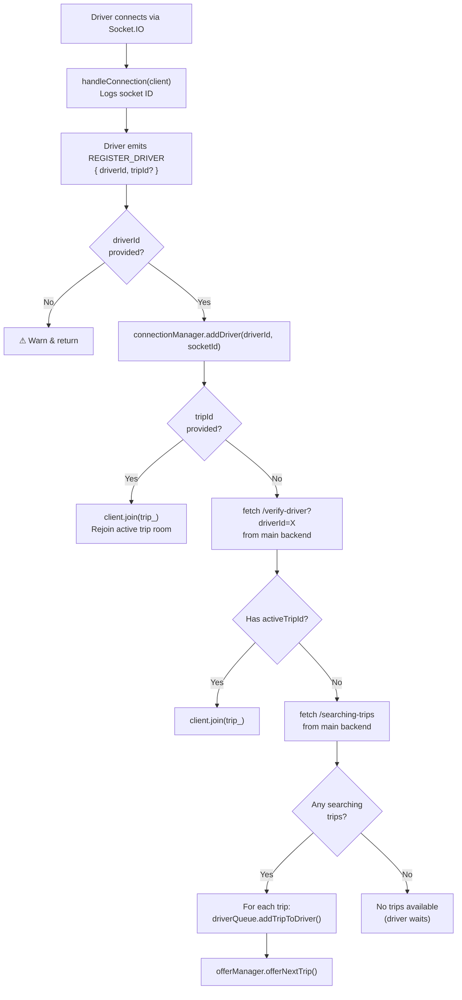
```mermaid
flowchart TD
    A["Driver connects via Socket.IO"] --> B["handleConnection(client)<br/>Logs socket ID"]
    B --> C["Driver emits REGISTER_DRIVER<br/>{ driverId, tripId? }"]
    C --> D{"driverId<br/>provided?"}
    D -->|No| E["⚠ Warn & return"]
    D -->|Yes| F["connectionManager.addDriver(driverId, socketId)"]

    F --> G{"tripId<br/>provided?"}
    G -->|Yes| H["client.join(trip_<tripId>)<br/>Rejoin active trip room"]
    G -->|No| I["fetch /verify-driver?driverId=X<br/>from main backend"]

    I --> J{"Has activeTripId?"}
    J -->|Yes| K["client.join(trip_<activeTripId>)"]
    J -->|No| L["fetch /searching-trips<br/>from main backend"]

    L --> M{"Any searching<br/>trips?"}
    M -->|Yes| N["For each trip:<br/>driverQueue.addTripToDriver()"]
    N --> O["offerManager.offerNextTrip()"]
    M -->|No| P["No trips available<br/>(driver waits)"]
```

**Three registration paths:**
1. **Rejoin** — `tripId` is provided → driver was already on a trip, just rejoin the room
2. **Verify** — No `tripId` → ask main backend if driver has an active trip → join that room
3. **Fresh** — No active trip → fetch all currently-searching trips from backend → queue them all and start offering

---

#### `REGISTER_USER`

| Property | Value |
|---|---|
| **Input** | `{ userId: string\|number, tripId?: string\|number }` |

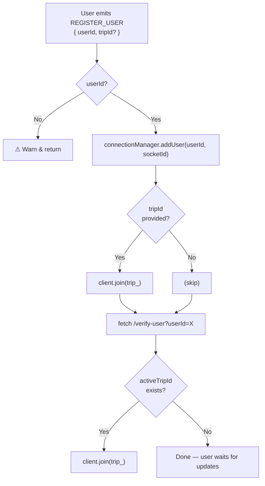
```mermaid
flowchart TD
    A["User emits REGISTER_USER<br/>{ userId, tripId? }"] --> B{"userId?"}
    B -->|No| C["⚠ Warn & return"]
    B -->|Yes| D["connectionManager.addUser(userId, socketId)"]
    D --> E{"tripId<br/>provided?"}
    E -->|Yes| F["client.join(trip_<tripId>)"]
    E -->|No| G["(skip)"]
    F --> H["fetch /verify-user?userId=X"]
    G --> H
    H --> I{"activeTripId<br/>exists?"}
    I -->|Yes| J["client.join(trip_<activeTripId>)"]
    I -->|No| K["Done — user waits for updates"]
```

---

#### `ACCEPT_OFFER`

| Property | Value |
|---|---|
| **Input** | `{ tripId: number }` |
| **Calls** | `POST /accept-trip` on main backend |

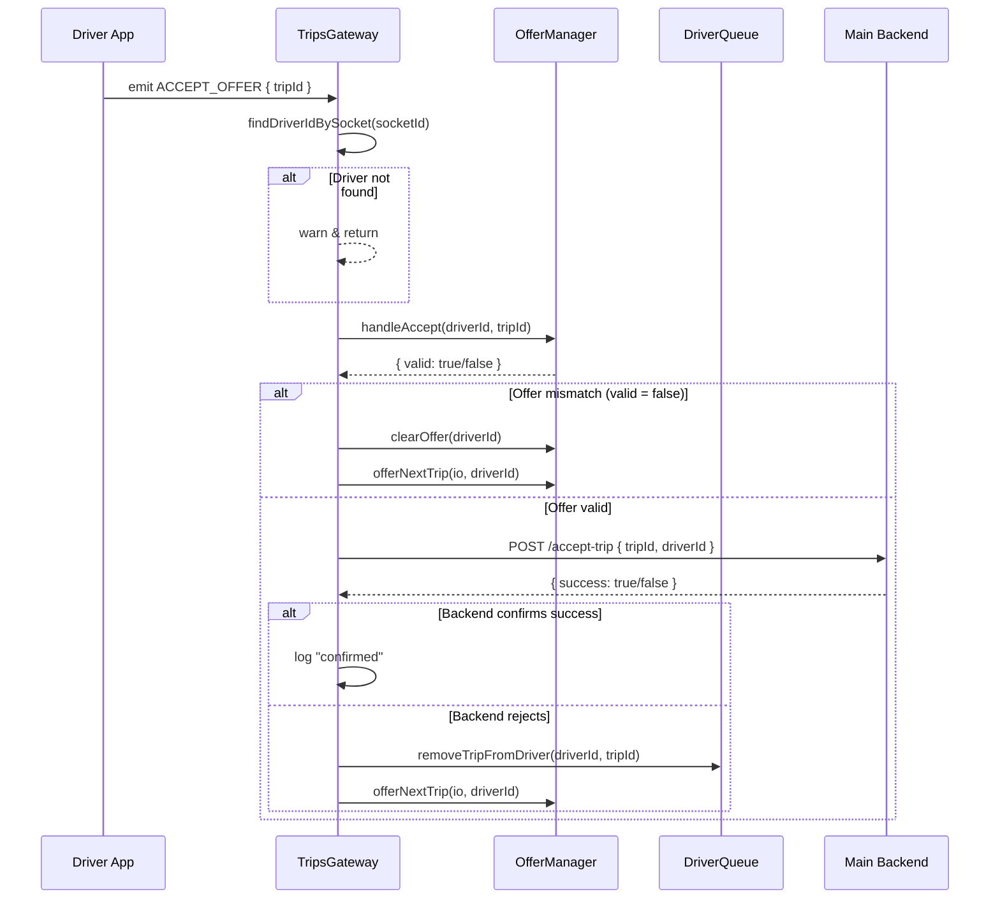
```mermaid
sequenceDiagram
    participant Driver as Driver App
    participant GW as TripsGateway
    participant OM as OfferManager
    participant DQ as DriverQueue
    participant BE as Main Backend

    Driver->>GW: emit ACCEPT_OFFER { tripId }
    GW->>GW: findDriverIdBySocket(socketId)

    alt Driver not found
        GW-->>GW: warn & return
    end

    GW->>OM: handleAccept(driverId, tripId)
    OM-->>GW: { valid: true/false }

    alt Offer mismatch (valid = false)
        GW->>OM: clearOffer(driverId)
        GW->>OM: offerNextTrip(io, driverId)
    else Offer valid
        GW->>BE: POST /accept-trip { tripId, driverId }
        BE-->>GW: { success: true/false }

        alt Backend confirms success
            GW->>GW: log "confirmed"
        else Backend rejects
            GW->>DQ: removeTripFromDriver(driverId, tripId)
            GW->>OM: offerNextTrip(io, driverId)
        end
    end
```

---

#### `REJECT_OFFER`

| Property | Value |
|---|---|
| **Input** | `{ tripId: number }` |

**Flow:**
1. Resolve `driverId` from `socketId`
2. Verify the current offer matches the `tripId` being rejected
3. Call `offerManager.handleReject(io, driverId)`:
   - Clears the screen timer
   - Rotates the current trip to the back of the queue
   - After a **3-second gap**, offers the next trip

---

#### `disconnect` (automatic)

| Property | Value |
|---|---|
| **Input** | *(automatic on socket disconnect)* |

**Flow:**
1. `connectionManager.removeDriverBySocketId(socketId)` → returns driverId if was a driver
2. `connectionManager.removeUserBySocketId(socketId)` → returns userId if was a user
3. If it was a driver → `offerManager.cleanupDriver(driverId)`:
   - Clears any active offer + screen timer
   - Clears the entire driver queue

---

### 5.3 WebSocket Events (server → client)

| Event | Target | Payload | When |
|---|---|---|---|
| `OFFER_TRIP` | Single driver socket | `{ tripId, screenTimeout }` | When a trip is offered from the queue |
| `OFFER_EXPIRED` | Single driver socket | `{ tripId }` | When 30s screen timer runs out |
| `CLOSE_RIDE_REQ` | All sockets (broadcast) | `{ driverId, tripId }` | When a trip is accepted — tells all drivers to dismiss it |
| `TRIP_ACCEPTED` | Trip room | `{ tripId, driverId }` | Status 2 from backend |
| `TRIP_STARTED` | Trip room | `{ tripId, driverId }` | Status 4 from backend |
| `TRIP_COMPLETED` | Trip room | `{ tripId }` | Status 5 from backend |
| `TRIP_CANCELLED` | Trip room | `{ tripId }` | Status 6 or 7 from backend |
| `RIDE_REVOKED` | All sockets (broadcast) | `{ tripId }` | Status 3 or 8 from backend |
| `RIDE_CANCEL_BY_USER` | All sockets (broadcast) | `{ tripId }` | Status 6 from backend |
| `RIDE_CANCEL_BY_DRIVER` | All sockets (broadcast) | `{ tripId }` | Status 7 from backend |

---

## 6. The Three Core Services

### 6.1 ConnectionManagerService

**File:** [`src/trips/services/connection-manager.service.ts`](src/trips/services/connection-manager.service.ts)

**State:**
```
onlineDrivers: { [driverId]: socketId }
onlineUsers:   { [userId]:   socketId }
```

| Method | Input | Output | Purpose |
|---|---|---|---|
| `addDriver(driverId, socketId)` | ID + socket | void | Register a driver connection |
| `removeDriverBySocketId(socketId)` | socket ID | driverId or null | Unregister on disconnect |
| `getDriverSocketId(driverId)` | driver ID | socketId or null | Look up socket for emitting |
| `getAllDriverIds()` | none | string[] | List all connected drivers |
| `addUser(userId, socketId)` | ID + socket | void | Register a user connection |
| `removeUserBySocketId(socketId)` | socket ID | userId or null | Unregister on disconnect |
| `getUserSocketId(userId)` | user ID | socketId or null | Look up socket for emitting |
| `tripRoom(tripId)` | trip ID | `"trip_<id>"` | Generate room name |
| `joinDriverToTripRoom(io, driverId, tripId)` | server + IDs | void | Put driver socket in room |
| `joinUserToTripRoom(io, userId, tripId)` | server + IDs | void | Put user socket in room |

---

### 6.2 DriverQueueService

**File:** [`src/trips/services/driver-queue.service.ts`](src/trips/services/driver-queue.service.ts)

**State:**
```
driverQueues: {
  [driverId]: [
    { tripId: 101, addedAt: 1712934000000, bgExpireAt: 1712934300000 },
    { tripId: 102, addedAt: 1712934005000, bgExpireAt: 1712934305000 },
    ...
  ]
}
```

Each driver has a **FIFO queue** of trips. Each entry has a `bgExpireAt` timestamp (5 minutes after being added). Expired entries are automatically purged whenever the queue is read.

| Method | Input | Output | Purpose |
|---|---|---|---|
| `addTripToDriver(driverId, tripId)` | IDs | `boolean` | Add trip to end of queue (returns false if duplicate) |
| `removeTripFromDriver(driverId, tripId)` | IDs | void | Remove specific trip from one driver |
| `removeTripFromAllDrivers(tripId)` | tripId | `string[]` (affected drivers) | Remove trip from every driver's queue |
| `getNextTrip(driverId)` | driverId | `QueueEntry \| null` | Peek at first trip (purges expired first) |
| `rotateCurrentTrip(driverId)` | driverId | `QueueEntry \| null` | Move front trip to back (unless expired), return new front |
| `getQueue(driverId)` | driverId | `QueueEntry[]` | Full queue snapshot |
| `getQueueSize(driverId)` | driverId | `number` | Queue length |
| `hasTripInQueue(driverId, tripId)` | IDs | `boolean` | Check if specific trip is queued |
| `clearDriver(driverId)` | driverId | void | Delete entire queue |
| `getDriversWithTrip(tripId)` | tripId | `string[]` | Find all drivers that have this trip queued |

---

### 6.3 OfferManagerService

**File:** [`src/trips/services/offer-manager.service.ts`](src/trips/services/offer-manager.service.ts)

**State:**
```
activeOffers: {
  [driverId]: {
    tripId: 101,
    screenTimerId: <Timeout ref>   // the 30s timer handle
  }
}
```

Only **one** offer can be active per driver at a time.

| Method | Input | Output | Purpose |
|---|---|---|---|
| `offerNextTrip(io, driverId)` | server + ID | void | Pop next trip from queue and emit `OFFER_TRIP` to driver, start 30s timer |
| `handleAccept(driverId, tripId)` | IDs | `{ valid, tripId }` | Validate accept matches current offer, clear timer |
| `handleReject(io, driverId)` | server + ID | void | Clear offer, rotate queue, offer next after 3s gap |
| `clearOffer(driverId)` | ID | void | Cancel screen timer + delete offer |
| `getOffer(driverId)` | ID | `ActiveOffer \| null` | Get current offer |
| `hasOffer(driverId)` | ID | `boolean` | Check if driver has an offer |
| `clearAllOffersForTrip(io, tripId)` | server + tripId | void | Clear offer from all drivers showing this trip, then offer them next trips |
| `cleanupDriver(driverId)` | ID | void | Clear offer + clear entire queue (used on disconnect) |

---

## 7. Timer Mechanics

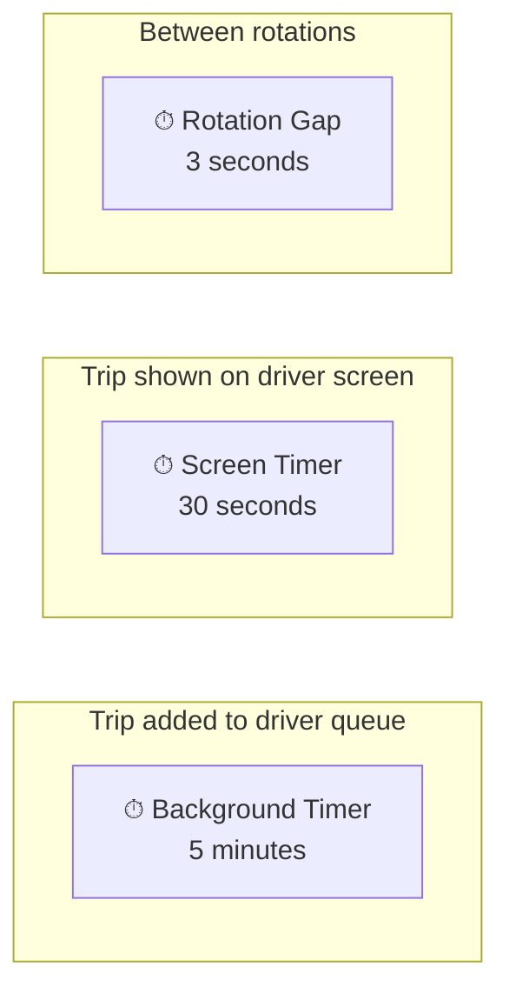
```mermaid
graph LR
    subgraph "Trip added to driver queue"
        BG["⏱ Background Timer<br/>5 minutes"]
    end

    subgraph "Trip shown on driver screen"
        ST["⏱ Screen Timer<br/>30 seconds"]
    end

    subgraph "Between rotations"
        RG["⏱ Rotation Gap<br/>3 seconds"]
    end
```

### How the timers interact:

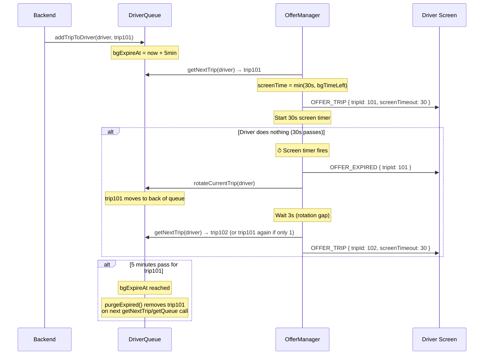
```mermaid
sequenceDiagram
    participant Backend
    participant Queue as DriverQueue
    participant Offer as OfferManager
    participant Screen as Driver Screen

    Backend->>Queue: addTripToDriver(driver, trip101)
    Note over Queue: bgExpireAt = now + 5min

    Offer->>Queue: getNextTrip(driver) → trip101
    Note over Offer: screenTime = min(30s, bgTimeLeft)
    Offer->>Screen: OFFER_TRIP { tripId: 101, screenTimeout: 30 }
    Note over Offer: Start 30s screen timer

    alt Driver does nothing (30s passes)
        Note over Offer: ⏱ Screen timer fires
        Offer->>Screen: OFFER_EXPIRED { tripId: 101 }
        Offer->>Queue: rotateCurrentTrip(driver)
        Note over Queue: trip101 moves to back of queue
        Note over Offer: Wait 3s (rotation gap)
        Offer->>Queue: getNextTrip(driver) → trip102 (or trip101 again if only 1)
        Offer->>Screen: OFFER_TRIP { tripId: 102, screenTimeout: 30 }
    end

    alt 5 minutes pass for trip101
        Note over Queue: bgExpireAt reached
        Note over Queue: purgeExpired() removes trip101<br/>on next getNextTrip/getQueue call
    end
```

> **Important:** The **screen timer** is always capped at the remaining background time:
> `screenTimeMs = Math.min(SCREEN_TIMER_MS, bgTimeLeft)`
> So if a trip only has 10 seconds of background time left, the screen timer will be 10s, not 30s.

---

## 8. Complete Trip Lifecycle — State Machine

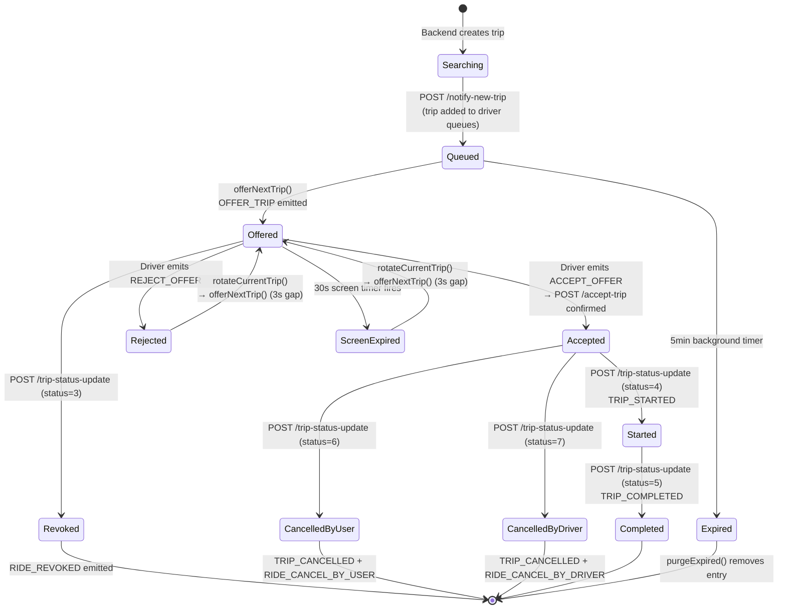
```mermaid
stateDiagram-v2
    [*] --> Searching: Backend creates trip

    Searching --> Queued: POST /notify-new-trip<br/>(trip added to driver queues)

    Queued --> Offered: offerNextTrip()<br/>OFFER_TRIP emitted

    Offered --> Accepted: Driver emits ACCEPT_OFFER<br/>→ POST /accept-trip confirmed
    Offered --> Rejected: Driver emits REJECT_OFFER
    Offered --> ScreenExpired: 30s screen timer fires
    Offered --> Revoked: POST /trip-status-update (status=3)

    Rejected --> Offered: rotateCurrentTrip()<br/>→ offerNextTrip() (3s gap)

    ScreenExpired --> Offered: rotateCurrentTrip()<br/>→ offerNextTrip() (3s gap)

    Accepted --> Started: POST /trip-status-update (status=4)<br/>TRIP_STARTED
    Accepted --> CancelledByUser: POST /trip-status-update (status=6)
    Accepted --> CancelledByDriver: POST /trip-status-update (status=7)

    Started --> Completed: POST /trip-status-update (status=5)<br/>TRIP_COMPLETED

    Revoked --> [*]: RIDE_REVOKED emitted
    CancelledByUser --> [*]: TRIP_CANCELLED + RIDE_CANCEL_BY_USER
    CancelledByDriver --> [*]: TRIP_CANCELLED + RIDE_CANCEL_BY_DRIVER
    Completed --> [*]

    Queued --> Expired: 5min background timer
    Expired --> [*]: purgeExpired() removes entry
```

---

## 9. End-to-End Example: Full Trip Flow

Here's what happens for a complete trip from creation to completion:

```
1. User requests a ride in the User App
2. User App → Main Backend: POST /create-trip
3. Main Backend creates the trip, finds nearby drivers [D1, D2, D3]
4. Main Backend → This Server: POST /notify-new-trip { tripId: 500, drivers: ["D1", "D2", "D3"] }

5. For each driver:
   └─ DriverQueueService.addTripToDriver("D1", 500)  →  { tripId:500, bgExpireAt: now+5min }
   └─ If D1 has no active offer → OfferManagerService.offerNextTrip(io, "D1")
      └─ Emits OFFER_TRIP { tripId: 500, screenTimeout: 30 } to D1's socket
      └─ Starts 30-second screen timer for D1

6. D1's app shows the trip card with a 30s countdown
   └─ D1 taps "Accept"
   └─ D1 App → Server: emit ACCEPT_OFFER { tripId: 500 }

7. Gateway.handleAcceptOffer:
   └─ Finds driverId from socket
   └─ OfferManager.handleAccept("D1", 500) → { valid: true }
   └─ Server → Main Backend: POST /accept-trip { tripId: 500, driverId: "D1" }
   └─ Backend responds { success: true }

8. Main Backend → This Server: POST /trip-status-update { status: 2, tripId: 500, driverId: "D1", userId: "U1" }

9. Controller handles ACCEPTED:
   └─ ConnectionManager.joinDriverToTripRoom(io, "D1", 500)  →  D1 joins room "trip_500"
   └─ ConnectionManager.joinUserToTripRoom(io, "U1", 500)    →  U1 joins room "trip_500"
   └─ Emit TRIP_ACCEPTED { tripId: 500, driverId: "D1" } → to room "trip_500"
   └─ Emit CLOSE_RIDE_REQ { driverId: "D1", tripId: 500 } → broadcast to ALL
   └─ DriverQueue.removeTripFromAllDrivers(500) → removes from D2, D3 queues
   └─ OfferManager.clearAllOffersForTrip(io, 500) → clears D2/D3 offers, offers them next trips

10. Trip is now active. User and Driver are in the same room "trip_500"

11. Main Backend → POST /trip-status-update { status: 4, tripId: 500 }
    └─ Emit TRIP_STARTED to room "trip_500"

12. Main Backend → POST /trip-status-update { status: 5, tripId: 500 }
    └─ Emit TRIP_COMPLETED to room "trip_500"
```

---

## 10. DTOs & Validation

All REST payloads are validated using `class-validator` decorators via NestJS's global `ValidationPipe` (configured with `whitelist: true, transform: true`).

### NotifyNewTripDto

```typescript
{
  tripId: number;    // @IsNumber, @IsNotEmpty
  drivers: (string | number)[];  // @IsArray, @IsNotEmpty
}
```

### TripStatusUpdateDto

```typescript
{
  status: number;              // @IsNumber, @IsNotEmpty
  tripId: number;              // @IsNumber, @IsNotEmpty
  driverId?: string | number;  // @IsOptional
  userId?: string | number;    // @IsOptional
}
```

---

## 11. External API Calls (this server → main backend)

| Call | Method | URL | When | Response Expected |
|---|---|---|---|---|
| Verify driver | GET | `{BACKEND_BASE_URL}verify-driver?driverId=X` | On REGISTER_DRIVER | `{ activeTripId?: string }` |
| Verify user | GET | `{BACKEND_BASE_URL}verify-user?userId=X` | On REGISTER_USER | `{ activeTripId?: string }` |
| Fetch searching trips | GET | `{BACKEND_BASE_URL}searching-trips` | On REGISTER_DRIVER (no active trip) | `Array<{ id: number }>` |
| Accept trip | POST | `{BACKEND_BASE_URL}accept-trip` | On ACCEPT_OFFER | `{ success: boolean, message?: string }` |

> **Note:** All external calls use the native `fetch` API. The base URL defaults to `https://loadgo.in/loadgotest/` and can be overridden via the `BACKEND_URL` environment variable.

---

## 12. Configuration Reference

| Constant | Value | File | Purpose |
|---|---|---|---|
| `BACKEND_BASE_URL` | `process.env.BACKEND_URL \|\| "https://loadgo.in/loadgotest/"` | `app.config.ts` | Main backend API base |
| `SCREEN_TIMER_MS` | `30,000` (30s) | `app.config.ts` | How long a trip is shown on driver screen |
| `BACKGROUND_TIMER_MS` | `300,000` (5min) | `app.config.ts` | Total lifetime of a trip in a driver's queue |
| `ROTATION_GAP_MS` | `3,000` (3s) | `app.config.ts` | Pause between trip rotations |
| Port | `process.env.PORT \|\| 3000` | `main.ts` | Server listen port |
| CORS | `origin: '*'` | `main.ts` + gateway | Allow all origins |

---

## 13. Socket Room Strategy

```mermaid
graph TD
    subgraph "Global Namespace (io)"
        direction LR
        D1["Driver D1<br/>socket: abc123"]
        D2["Driver D2<br/>socket: def456"]
        U1["User U1<br/>socket: ghi789"]
        U2["User U2<br/>socket: jkl012"]
    end

    subgraph "Room: trip_500"
        D1_R["D1"]
        U1_R["U1"]
    end

    subgraph "Room: trip_501"
        D2_R["D2"]
        U2_R["U2"]
    end

    D1 -.-> D1_R
    U1 -.-> U1_R
    D2 -.-> D2_R
    U2 -.-> U2_R
```

- **Unicast** (to one driver): `io.to(socketId).emit(...)` — used for `OFFER_TRIP`, `OFFER_EXPIRED`
- **Room broadcast** (to trip participants): `io.to("trip_<id>").emit(...)` — used for `TRIP_ACCEPTED`, `TRIP_STARTED`, `TRIP_COMPLETED`, `TRIP_CANCELLED`
- **Global broadcast** (to everyone): `io.emit(...)` — used for `CLOSE_RIDE_REQ`, `RIDE_REVOKED`, `RIDE_CANCEL_BY_USER`, `RIDE_CANCEL_BY_DRIVER`
